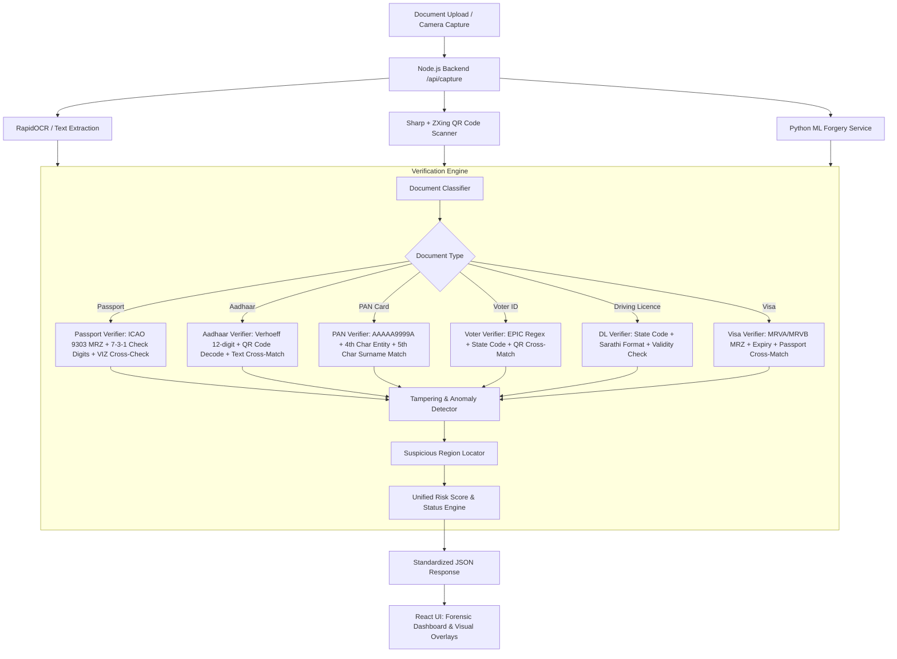

# Document-Specific Verification Engine Implementation Plan

Build a comprehensive **Document-Specific Verification Engine** for the MERN-based AI Document Fraud Detection website that automatically identifies document types (Aadhaar, Passport, Visa, Voter ID, PAN Card, Driving Licence), executes document-specific cryptographic & structural rules, cross-validates OCR text against QR/MRZ data, detects tampering, flags suspicious regions, and returns standardized risk assessment results to the frontend.

---

## Architecture Overview



---

## Proposed Changes

### Backend Implementation (`backend/`)

#### [NEW] [levenshtein.js](file:///c:/Users/HP/Desktop/Border%20Identificator/backend/verification/utils/levenshtein.js)
- Levenshtein distance & similarity score utility for resilient fuzzy comparison between OCR text and MRZ/QR data (handles OCR optical noise).

#### [NEW] [verhoeff.js](file:///c:/Users/HP/Desktop/Border%20Identificator/backend/verification/utils/verhoeff.js)
- Official Verhoeff checksum validation algorithm for Aadhaar 12-digit UID numbers.

#### [NEW] [mrzParser.js](file:///c:/Users/HP/Desktop/Border%20Identificator/backend/verification/utils/mrzParser.js)
- ICAO Doc 9303 compliant MRZ parser for TD1 (3x30), TD2 (2x36), TD3 (2x44, Passports), MRVA (2x44, Visas), MRVB (2x36, Visas).
- Calculates standard 7-3-1 weighting check digits: Document number, DOB, Expiry date, Optional/Personal number, and Composite check digit.

#### [NEW] [qrDecoder.js](file:///c:/Users/HP/Desktop/Border%20Identificator/backend/verification/utils/qrDecoder.js)
- Enhanced QR decoder using `sharp` preprocessing (grayscale, binarize, contrast boost) + `@zxing/library` MultiFormatReader.
- Handles XML UIDAI QR codes, modern Secure Aadhaar QR codes, Voter ID QR payloads, and standard URLs/JSON payloads.

#### [NEW] [classifier.js](file:///c:/Users/HP/Desktop/Border%20Identificator/backend/verification/classifier.js)
- Multi-factor document classifier identifying `Passport`, `Aadhaar`, `PAN Card`, `Voter ID`, `Driving Licence`, `Visa`, or `Unknown`.

#### [NEW] [passportVerifier.js](file:///c:/Users/HP/Desktop/Border%20Identificator/backend/verification/verifiers/passportVerifier.js)
- Extracts and validates MRZ, checks 5 ICAO check digits, compares MRZ with Visual Inspection Zone (VIZ) OCR text (Passport No, Name, DOB, Expiry, Nationality, Gender), flags mismatches and expiration.

#### [NEW] [aadhaarVerifier.js](file:///c:/Users/HP/Desktop/Border%20Identificator/backend/verification/verifiers/aadhaarVerifier.js)
- Validates 12-digit UID format and Verhoeff check digit.
- Extracts QR code data and compares Name, DOB/Year of Birth, Gender, and Aadhaar number against OCR text.

#### [NEW] [panVerifier.js](file:///c:/Users/HP/Desktop/Border%20Identificator/backend/verification/verifiers/panVerifier.js)
- Validates PAN format `[A-Z]{5}[0-9]{4}[A-Z]`.
- Checks 4th character entity type (P for Individual, C for Company, etc.).
- Checks 5th character against extracted applicant's surname initial.
- Validates DOB and father's name consistency.

#### [NEW] [voterVerifier.js](file:///c:/Users/HP/Desktop/Border%20Identificator/backend/verification/verifiers/voterVerifier.js)
- Validates EPIC number format (`[A-Z]{3}[0-9]{7}` or state codes).
- Cross-matches with QR data when present.
- Validates Election Commission headers and extracted voter details.

#### [NEW] [drivingLicenceVerifier.js](file:///c:/Users/HP/Desktop/Border%20Identificator/backend/verification/verifiers/drivingLicenceVerifier.js)
- Detects issuing Indian state from 2-letter state code prefix (DL, MH, KA, TN, UP, GJ, etc.).
- Validates Sarathi national standard format `SS-RR-YYYYNNNNNNN`.
- Checks issue year (1970 - present) and validity.

#### [NEW] [visaVerifier.js](file:///c:/Users/HP/Desktop/Border%20Identificator/backend/verification/verifiers/visaVerifier.js)
- Detects Visa structure and MRVA/MRVB zone.
- Checks check digits, validity period, and consistency.

#### [NEW] [tamperingDetector.js](file:///c:/Users/HP/Desktop/Border%20Identificator/backend/verification/tamperingDetector.js)
- Cross-validates OCR vs QR/MRZ data.
- Detects altered dates, modified document numbers, forged names, and logical contradictions (e.g. DOB in future, expired validity).
- Identifies suspicious regions (bounding box hints for altered data fields).

#### [NEW] [verificationEngine.js](file:///c:/Users/HP/Desktop/Border%20Identificator/backend/verification/index.js)
- Master verification orchestrator unifying classification, document-specific verification, tampering detection, and standardized response generation:
  ```json
  {
    "documentType": "Passport",
    "riskScore": 12,
    "status": "Likely Genuine",
    "checks": {
      "mrzValid": true,
      "checkDigitsValid": true,
      "expiryValid": true,
      "dataMatch": true
    },
    "warnings": [],
    "details": { ... },
    "suspiciousRegions": [ ... ]
  }
  ```

#### [MODIFY] [server.js](file:///c:/Users/HP/Desktop/Border%20Identificator/backend/server.js)
- Integrate the Verification Engine into `/api/capture` and add a direct `/api/verify-document` route.
- Execute QR code decoding alongside OCR and ML analysis.

---

### Frontend Implementation (`frontend/`)

#### [MODIFY] [AnalysisResult.jsx](file:///c:/Users/HP/Desktop/Border%20Identificator/frontend/src/components/AnalysisResult.jsx)
- Redesign the analysis results view into a comprehensive security forensic report:
  - Header with Document Type Badge (Passport, Aadhaar, PAN, Voter ID, Driving Licence, Visa).
  - Risk Gauge with dynamic color palette (Low Risk / Medium Risk / High Risk).
  - Security Checks Grid displaying document-specific pass/fail indicators (`mrzValid`, `checkDigitsValid`, `expiryValid`, `dataMatch`, `formatValid`, `verhoeffValid`, etc.).
  - Document Details card with extracted fields (Document No, Holder Name, DOB, Expiry, Issuing Authority).
  - Cross-Validation Comparison Table (OCR Text vs QR/MRZ Data with match confidence).
  - Warnings & Tampering Alerts panel with flagged inconsistencies.
  - Suspicious Region highlighter overlay on document preview.

#### [MODIFY] [CameraScanner.jsx](file:///c:/Users/HP/Desktop/Border%20Identificator/frontend/src/components/CameraScanner.jsx)
- Ensure `scanResult` accurately captures the full verification response and updates the UI smoothly.

---

## Verification Plan

### Automated / Backend Tests
1. Run Node.js verification test suite against sample test vectors:
   - Sample Passport MRZ (ICAO 9303 TD3 valid & invalid check digit test vectors).
   - Sample Aadhaar (valid & invalid 12-digit Verhoeff, XML QR code).
   - Sample PAN Card (valid format, matching surname vs mismatched surname).
   - Sample Voter ID (valid EPIC format & invalid format).
   - Sample Driving Licence (valid state prefix & Sarathi format).
   - Sample Visa (valid MRVA format).
   - Tampered document simulations (date mismatch, number mismatch).

### Manual Verification
1. Start backend server (`node server.js` on port 5000).
2. Upload test document images via the frontend UI.
3. Validate that:
   - Document type is accurately classified.
   - Specific checks for the document type execute and show green checks or red warning flags.
   - Risk score and status are calculated accurately.
   - The JSON payload conforms strictly to user specifications.
